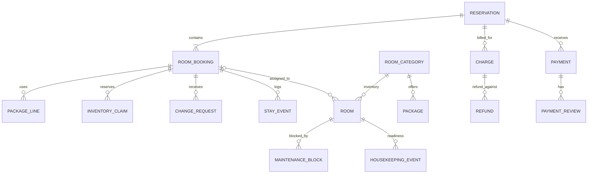

# Entity Relationship Blueprint

```mermaid
erDiagram
  RESERVATION ||--|{ ROOM_BOOKING : contains
  RESERVATION ||--o{ PAYMENT : receives
  RESERVATION ||--o{ CHARGE : billed_for
  ROOM_BOOKING ||--o{ PACKAGE_LINE : uses
  ROOM_BOOKING ||--o{ INVENTORY_CLAIM : reserves
  ROOM_BOOKING ||--o{ CHANGE_REQUEST : receives
  ROOM_BOOKING ||--o{ STAY_EVENT : logs
  ROOM_BOOKING o|--o{ ROOM : assigned_to
  ROOM_CATEGORY ||--o{ ROOM : inventory
  ROOM_CATEGORY ||--o{ PACKAGE : offers
  ROOM ||--o{ MAINTENANCE_BLOCK : blocked_by
  ROOM ||--o{ HOUSEKEEPING_EVENT : readiness
  CHARGE ||--o{ REFUND : refund_against
  PAYMENT ||--o{ PAYMENT_REVIEW : has
```

**Conceptual** only. DB constraints/columns explained in [[07-database-schema]].
